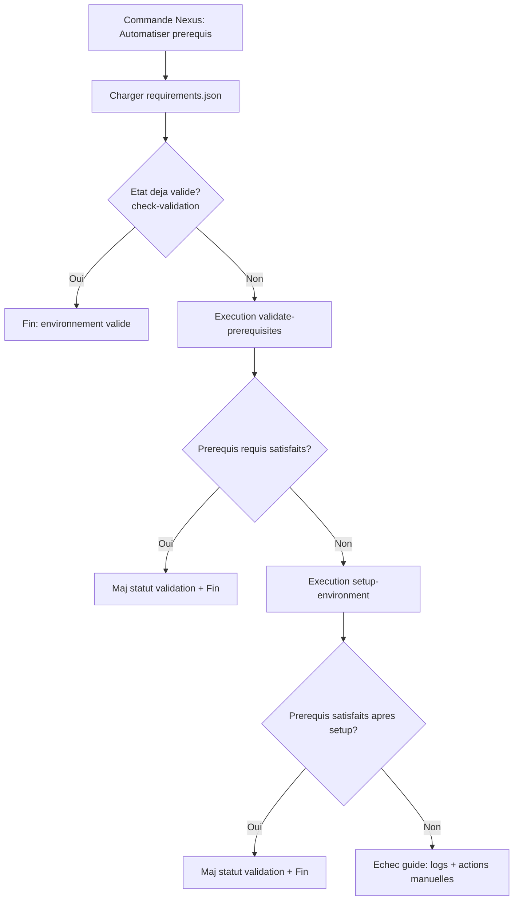

# Plan d implementation - Automatisation des prerequis projet

Date: 2026-07-30
Auteur: Rusty (Architect)
Projet cible: nexus-nexkit-vscode

## 1) Introduction

### Objectif du document

Ce document definit l implementation d une fonctionnalite Nexus qui automatise la verification, la validation et l installation des prerequis d un projet, en s appuyant sur des scripts cross-platform deja utilises dans <project-root> (ici dans `./gl-afeas/`).

Objectif principal:

- reduire le temps de demarrage d un projet
- limiter les erreurs d environnement local
- rendre le flux deterministic et observable (retours clairs, codes de sortie, traces)

### Contexte du projet

Dans <project-root>, la logique de prerequis existe deja via:

- requirements.json
- scripts de validation et de setup en PowerShell et Bash

Le besoin ici est de transformer ce pattern en fonctionnalite reutilisable dans nexus-nexkit-vscode, avec un flux pilote par commande VS Code et des points d extension pour plusieurs projets.

### Portee de l implementation

Inclus:

- orchestration du flux prerequis (check -> validate -> setup)
- support Windows (PowerShell) et Unix (Bash)
- lecture standardisee des prerequis depuis requirements.json
- statut de validation stocke dans un fichier de settings local de workspace
- creation d un script manquant check-validation.sh
- journalisation exploitable pour support et debug

Exclus:

- modification du contenu fonctionnel metier des scripts <project-root>
- ajout de nouvelles dependances outillees non necessaires
- execution automatique silencieuse sans consentement utilisateur pour installation

## 2) Description des fichiers concernes

### requirements.json

Reference: <project-root>/requirements.json

Role:

- source de verite des prerequis
- decrit nom, commande, version minimale, caractere requis/optionnel et hints d installation

Structure observee:

- prerequisites[]
  - name
  - command
  - versionCommand
  - required
  - minimumVersion
  - install.winget
  - install.npm
  - install.hint
  - install.url

Decision d implementation:

- la fonctionnalite Nexus doit parser cette structure sans schema proprietaire supplementaire
- la validation de schema doit detecter les champs manquants et retourner une erreur actionnable

### Check-Validation.ps1 et check-validation.sh (a creer)

References:

- <project-root>/scripts/Check-Validation.ps1
- <project-root>/scripts/check-validation.sh (a creer)

Role:

- verifier rapidement l etat de validation deja calcule
- eviter de relancer une validation complete si l etat est deja valide

Comportement attendu:

- lire un fichier local de settings du workspace
- retourner un marqueur standard, par exemple VALIDATED=true/false
- code de sortie 0 si valide, 1 sinon

Contrainte importante:

- check-validation.sh n existe pas aujourd hui
- il doit etre cree avec parite fonctionnelle du script PowerShell (meme semantique de sortie)

### Validate-Prerequisites.ps1 et validate-prerequisites.sh

References:

- <project-root>/scripts/Validate-Prerequisites.ps1
- <project-root>/scripts/validate-prerequisites.sh

Role:

- tester la presence des outils
- verifier les versions minimales
- proposer/declencher l installation selon mode interactif
- mettre a jour le statut de validation

Comportements techniques observes:

- PowerShell:
  - charge requirements.json
  - Test-Tool + Try-InstallTool
  - ecrit afeas.prerequisites.validated et validationDate dans settings local
- Bash:
  - depend de jq
  - verifie command -v + version
  - compare versions
  - resume final et code sortie global

Decision d implementation:

- conserver le contrat de sortie: 0 = prerequis requis OK, 1 = KO
- remonter les details (missing/outdated/optional) dans les logs Nexus

### Setup-Environment.ps1 et setup-environment.sh

References:

- <project-root>/scripts/Setup-Environment.ps1
- <project-root>/scripts/setup-environment.sh

Role:

- appliquer le setup complet apres validation
- installer dependances front/back
- configurer elements annexes (ex: hooks git)
- persister un etat final valide

Comportements observes:

- orchestration par etapes
- arret sur erreur critique
- options de skip
- ecriture d un statut de completion

Decision d implementation:

- integrer ces scripts uniquement quand validate indique des manques persistants
- exposer un mode dry-run cote Nexus pour previsualiser actions

## 3) Architecture de l implementation

### Vue d ensemble

La fonctionnalite est exposee par une commande VS Code dans Nexus. Cette commande orchestre les scripts selon l OS et centralise les logs/resultats.

Points d integration Nexus (haut niveau):

- Command registration:
  - ajout d une commande dans le registre des commandes extension
- ServiceContainer:
  - injection des services prerequis
- Feature module:
  - nouveau module de gestion prerequis (lecture/verification/installation)

### Modules/fonctions proposes

1. PrerequisiteConfigService

- charge et valide requirements.json
- normalise les prerequis en modele interne

2. ValidationStateService

- lit/ecrit le statut validated + validationDate dans settings local workspace
- unifie les chemins de fichier selon projet

3. ScriptSelectorService

- detecte la plateforme (Windows vs Unix)
- mappe les scripts a executer:
  - check-validation: ps1 ou sh
  - validate-prerequisites: ps1 ou sh
  - setup-environment: ps1 ou sh

4. PrerequisiteRunnerService

- execute les scripts
- capture stdout/stderr/exit code
- applique timeouts et retries limites

5. PrerequisiteOrchestrator

- implemente le flux etape par etape
- decide la transition entre check, validate, setup
- produit un resultat final + recommandations

### Diagramme de flux (Mermaid)

## 4) Processus d installation des prerequis

### Etape 1: lecture requirements.json

- charger le fichier depuis le dossier scripts du projet cible
- valider schema minimal attendu
- preparer la liste des prerequis requis/optionnels

Sortie attendue:

- liste normalisee des prerequis
- erreur explicite si fichier absent ou invalide

### Etape 2: execution Check-Validation.ps1 + check-validation.sh

- selection du script selon OS
- execution rapide pour connaitre le statut existant

Regles:

- exit 0: deja valide -> fin du flux
- exit 1: non valide -> passer a l etape 3

Note implementation:

- ajouter check-validation.sh avec le meme contrat que Check-Validation.ps1

### Etape 3: si manquants, execution Validate-Prerequisites.ps1 + validate-prerequisites.sh

- lancer la validation complete
- verifier presence + version minimale
- tenter installation selon politique (interactive ou non)

Regles:

- exit 0: prerequis requis OK -> mise a jour statut puis fin
- exit 1: prerequis requis manquants/outdated -> passer a l etape 4

### Etape 4: si encore manquants, execution Setup-Environment.ps1 + setup-environment.sh

- lancer le setup global
- installer dependances projet et configurer l environnement
- relancer une verification finale (ou lire statut mis a jour)

Regles:

- si validation finale OK: succes
- sinon: echec avec rapport actionnable (outils manquants, commandes conseillees, liens)

## 5) Gestion des erreurs et exceptions

### Types d erreurs possibles

1. Fichier requirements.json introuvable ou JSON invalide
2. Script manquant (notamment check-validation.sh)
3. Outil manquant pour la validation (ex: jq en Unix)
4. Echec d execution script (permissions, policy, shell indisponible)
5. Echec installation prerequis (winget/npm indisponible, droits insuffisants)
6. Echec persistance etat validation
7. Timeout execution script

### Strategies de gestion des erreurs

- categoriser les erreurs: Configuration, Execution, Installation, Permission
- remonter un message utilisateur court + detail technique dans log
- arreter le flux sur erreur bloquante; continuer uniquement sur erreurs non critiques explicites
- fournir une action de remediaton immediate (commande hint ou URL)

### Journalisation pour debug/support

- log par etape avec:
  - script execute
  - commande effective
  - exit code
  - duree
  - resume stdout/stderr
- niveau INFO/WARN/ERROR
- correlation id par execution de la commande Nexus
- conservation des derniers rapports dans workspace state local

## 6) Tests et validation

### Plan de tests complet

A. Tests unitaires (services Nexus)

1. Parsing requirements.json valide
2. Detection schema invalide
3. Mapping script selon plateforme
4. Interpretration exit codes
5. Gestion erreurs et generation des messages utilisateur

B. Tests d integration (orchestrateur)

1. Check valide -> fin immediate
2. Check invalide + Validate OK
3. Check invalide + Validate KO + Setup OK
4. Check invalide + Validate KO + Setup KO
5. Script manquant (check-validation.sh)
6. Timeout script

C. Tests end-to-end (commande extension)

1. Lancement commande depuis UI
2. Affichage progression et resultat final
3. Logs complets recuperables

### Scenarios Windows + Unix

Windows:

- scripts PowerShell utilises
- cas winget dispo vs indispo
- policy PowerShell restrictive

Unix:

- scripts Bash utilises
- cas jq installe vs absent
- differences shell bash/zsh (execution via bash explicite)

## 7) Criteres d acceptation

1. Une commande Nexus declenche tout le flux prerequis de bout en bout.
2. La selection des scripts est correcte selon OS.
3. Le statut de validation est lu avant tout traitement lourd.
4. La validation complete est executee seulement si necessaire.
5. Le setup est execute seulement si la validation ne suffit pas.
6. check-validation.sh est cree et aligne fonctionnellement sur Check-Validation.ps1.
7. Les erreurs bloquantes renvoient un resultat explicite et actionnable.
8. Les logs contiennent script, exit code, duree et diagnostic.
9. Les scenarios Windows et Unix passent avec resultats coherents.
10. Aucun changement metier n est impose aux scripts existants pour la V1.

## 8) Risques et mitigations

Risque 1: Divergence de comportement PS1 vs SH

- Mitigation: definir un contrat commun d exit codes + marqueurs de sortie et tester parite.

Risque 2: Dependance a jq sur Unix

- Mitigation: verifier jq des le debut; message de remediaton clair; envisager fallback Node a terme.

Risque 3: Permissions/ExecutionPolicy

- Mitigation: detection precoce, message guide, documentation de contournement securisee.

Risque 4: Incoherence du fichier de statut local

- Mitigation: ecriture atomique et validation post-write.

Risque 5: UX confuse en cas d echec partiel

- Mitigation: resume final structure (OK/KO, causes, prochaines actions).

## 9) Conclusion

Ce plan decrit une implementation concrete pour ajouter dans nexus-nexkit-vscode une fonctionnalite d automatisation des prerequis, basee sur un flux progressif check -> validate -> setup. Il capitalise sur les scripts existants de <project-root>, ajoute la piece manquante check-validation.sh, et cadre les integrations extension (commande + services) pour fournir une experience fiable, observable et cross-platform.

Les objectifs vises sont:

- diminution des erreurs d environnement
- acceleration de l onboarding developpeur
- standardisation du diagnostic prerequis
