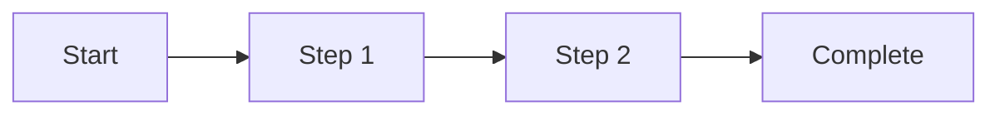
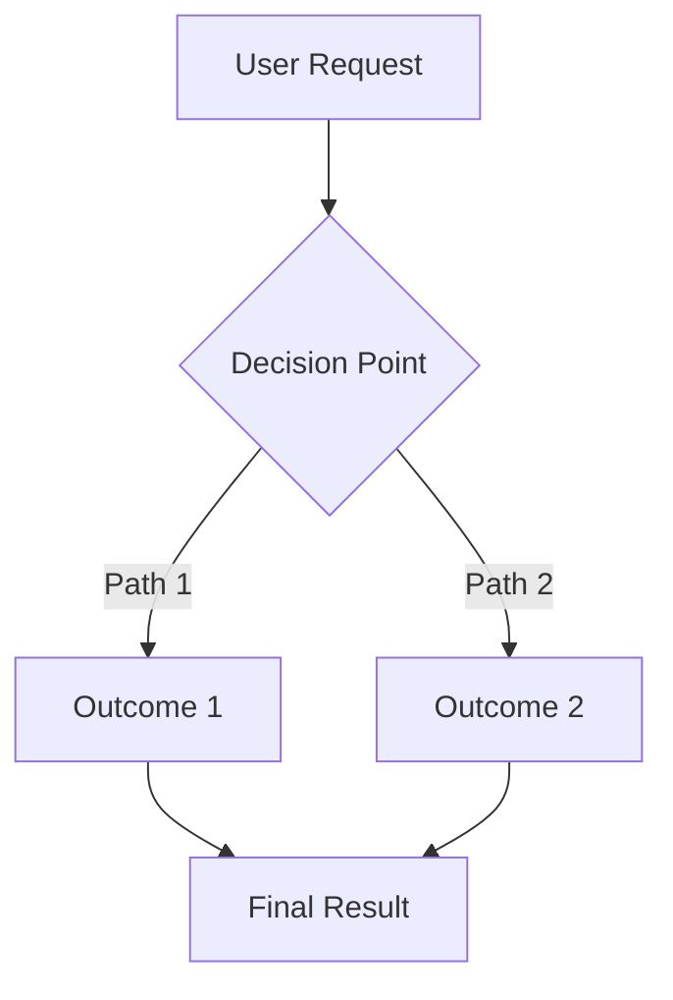
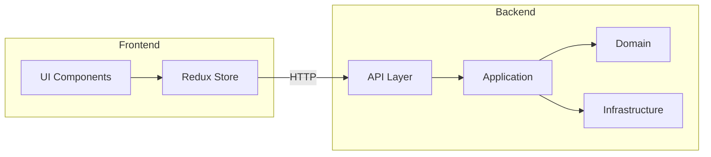

Given a work item reference provided as $ARGUMENTS or a description of what to document, execute the following documentation workflow based on the **Diátaxis**
framework, which organizes documentation into four distinct quadrants:

## 📚 Understanding Diátaxis Framework

The Diátaxis framework structures documentation into four types based on two axes:

**Acquisition vs Application** (horizontal) and **Practice vs Theory** (vertical)

```mermaid
graph
    subgraph " "
        T[📖 TUTORIALS<br/>Learning-oriented<br/>Acquisition + Practice]
        H[🔧 HOW-TO GUIDES<br/>Task-oriented<br/>Application + Practice]
        R[📋 REFERENCE<br/>Information-oriented<br/>Application + Theory]
        E[💡 EXPLANATION<br/>Understanding-oriented<br/>Acquisition + Theory]
    end
    T -.->|Practical steps| H
    T -.->|Understanding| E
    H -.->|Details| R
    E -.->|Details| R
```



- **📖 Tutorials**: Learning-oriented, take the user by the hand through a series of steps (acquisition + practice)
- **🔧 How-to Guides**: Task-oriented, guide the user through solving a specific problem (application + practice)
- **📋 Reference**: Information-oriented, describe the machinery (application + theory)
- **💡 Explanation**: Understanding-oriented, clarify and illuminate topics (acquisition + theory)

## Phase 1: Context Gathering

1. **Fetch Work Item Details**

   - Call `mcp_azure-devops_wit_get_work_item` with the work item ID and current project
   - Extract: id, title, description, work item type, state, acceptance criteria, tags
   - Read all child and related work items for complete context
   - Check for attached files with implementation details
   - Review work item comments for additional insights

2. **Analyze Implementation**

   - Search for related code changes using `grep_search` or `semantic_search`
   - Identify affected files, components, and layers (Frontend/Backend)
   - Review commit history if available
   - Understand the technical approach taken
   - Map out integration points and dependencies

3. **Gather Related Documentation**
   - Search for existing documentation that may need updates
   - Identify related features or components
   - Find architectural decision records (ADRs) if applicable
   - Review instruction files for relevant guidelines

## Phase 2: Diátaxis Quadrant Selection

4. **Determine Primary Documentation Quadrant**

   Analyze the work item and choose the primary Diátaxis quadrant(s):

   ### 📜 **Tutorial** (Learning-Oriented)

   **When to use**: New features that users need to learn from scratch

   - Takes the user on a learning journey
   - Focuses on getting started successfully
   - Provides concrete, repeatable steps
   - Builds confidence through small wins
   - Example: "Your First Airport Quote", "Getting Started with ASQ Analytics"

   ### 🆘 **How-To Guide** (Task-Oriented)

   **When to use**: Specific tasks or problem-solving scenarios

   - Assumes some knowledge exists
   - Solves a specific, real-world problem
   - Provides clear, actionable steps
   - Focuses on achieving a goal
   - Example: "How to Export Quotes to Excel", "How to Configure Email Notifications"

   ### 📋 **Reference** (Information-Oriented)

   **When to use**: API changes, configuration options, technical specifications

   - Provides complete, accurate technical information
   - Describes what something is/does
   - Structured for easy lookup
   - No unnecessary explanation
   - Example: "Quote API Endpoints", "Configuration Settings Reference"

   ### 💡 **Explanation** (Understanding-Oriented)

   **When to use**: Architectural decisions, concepts, design choices

   - Clarifies and deepens understanding
   - Discusses alternatives and trade-offs
   - Provides context and background
   - Makes connections between concepts
   - Example: "Quote Lifecycle Architecture", "Why We Use Clean Architecture"

5. **Plan Multi-Quadrant Documentation**

   Complex features may need multiple quadrants:

   - New feature with API changes → Tutorial + Reference
   - Bug fix with architectural impact → Explanation + How-To
   - Performance improvement → Explanation + Reference
   - New integration → Tutorial + How-To + Reference

## Phase 3: Content Generation (Diátaxis-Aligned)

6. **Write Content Following Diátaxis Principles**

   ### 📖 For Tutorials (Learning-Oriented)

   - **Start with a clear learning goal**: "By the end, you'll be able to..."
   - **Provide all prerequisites**: Software, accounts, knowledge needed
   - **Use concrete examples**: No placeholders, use real data
   - **Guide every step**: Assume no prior knowledge
   - **Show expected outcomes**: What success looks like
   - **Avoid explanation**: Focus on doing, not understanding why
   - **Build incrementally**: Each step adds one thing
   - **Ensure it works**: Must be tested and reproducible

   ### 🔧 For How-To Guides (Task-Oriented)

   - **Name the problem clearly**: "How to..." format
   - **Assume context**: Reader knows basics
   - **Focus on the goal**: Get to solution quickly
   - **Provide flexible steps**: Show the path, allow variations
   - **Avoid teaching**: Don't explain concepts
   - **Link to explanations**: For those who want to understand
   - **Use realistic scenarios**: Actual problems users face
   - **Offer alternatives**: Multiple ways when relevant

   ### 📋 For Reference (Information-Oriented)

   - **State facts accurately**: No opinion or speculation
   - **Be consistent**: Same structure throughout
   - **Stay authoritative**: This is the truth about the system
   - **Avoid explanation**: Describe what, not why
   - **Be complete**: Cover all options/parameters
   - **Structure for lookup**: Easy to scan and find
   - **Use tables**: Great for parameters, options, configs
   - **Include examples**: Brief, illustrative code samples

   ### 💡 For Explanation (Understanding-Oriented)

   - **Clarify concepts**: Help reader understand
   - **Provide context**: Historical, technical, business
   - **Discuss alternatives**: Why this approach vs others
   - **Make connections**: Link to related concepts
   - **Avoid instruction**: Don't tell them what to do
   - **Explore implications**: What does this mean?
   - **Use analogies**: Make complex ideas accessible
   - **Link to other quadrants**: Point to tutorials/how-tos/reference

7. **Create Visual Diagrams**
   Add diagrams where they enhance understanding:

   **For architecture/system design (Explanation):**

   ```mermaid
   graph TD
       A[Component A] -->|API Call| B[Component B]
       B --> C[Database]
   ```

   **For sequence flows (Tutorial/How-To):**

   ```mermaid
   sequenceDiagram
       User->>Frontend: Action
       Frontend->>Backend: API Request
       Backend->>Database: Query
       Database-->>Backend: Result
       Backend-->>Frontend: Response
       Frontend-->>User: Update UI
   ```

   **For state transitions (Explanation/Reference):**

   ```plantuml
   @startuml
   [*] --> Draft
   Draft --> UnderReview : Submit
   UnderReview --> Approved : Approve
   UnderReview --> Draft : Reject
   Approved --> [*]
   @enduml
   ```

   **For the Diátaxis compass itself:**

   ```mermaid
   ---
   config:
       quadrantChart:
           chartWidth: 800
           chartHeight: 400
   ---
   quadrantChart
       title Documentation Quadrants
       x-axis Acquisition --> Application
       y-axis Theory --> Practice
       quadrant-1 "How-To Guides (Task-Oriented)"
       quadrant-2 "Tutorials (Learning-Oriented)"
       quadrant-3 "Explanation(Understanding-Oriented)"
       quadrant-4 "Reference (Information-Oriented)"
   ```

8. **Add Code Examples and Links (Quadrant-Specific)**

   **For Tutorials**: Complete, runnable code with clear progression
   **For How-To**: Focused code snippets solving specific problems
   **For Reference**: Comprehensive API examples with all parameters
   **For Explanation**: Illustrative code showing concepts, not execution

   - Link to actual implementation files using **absolute** paths
   - Show before/after code snippets for changes (How-To/Explanation)
   - Include API endpoint examples with request/response (Reference)
   - Demonstrate usage patterns with realistic examples (Tutorial/How-To)
   - Reference configuration files or environment variables (Reference)

## Phase 4: Quality and Consistency

9. **Review Documentation Quality (Diátaxis Lens)**

   **Quadrant Adherence:**

   - ✅ **Stays in lane**: Doesn't mix tutorial with explanation, or reference with instruction
   - ✅ **Right tone**: Learning (tutorial), directing (how-to), describing (reference), discussing (explanation)
   - ✅ **Appropriate verbs**: Tutorials use "Let's/we", How-Tos use imperatives, Reference uses present tense, Explanation uses "you might/could"

   **Content Quality:**

   - ✅ **Accurate**: Technical details are correct and up-to-date
   - ✅ **Complete**: All important aspects covered for the quadrant
   - ✅ **Clear**: Easy to understand for target audience
   - ✅ **Concise**: No unnecessary fluff or redundancy
   - ✅ **Tested**: Code examples work as written

   **Structure:**

   - ✅ **Well-organized**: Logical flow with clear sections
   - ✅ **Properly formatted**: Consistent Markdown, working links
   - ✅ **Visually appealing**: Good use of formatting, emojis, diagrams
   - ✅ **Scannable**: Headers, lists, tables aid quick reading

10. **Add Metadata and Cross-References**

    **Document Header:**
    <details>
    <summary><strong>Click to see the template code</strong></summary>
    > **Work Item**: #12345 | **Type**: [Tutorial|How-To|Reference|Explanation] | **Status**: ✅ Complete
    </details>

    **Cross-Quadrant Links:**
    Always provide links to related content in other quadrants at the end:

    <details>
    <summary><strong>Click to see the template code</strong></summary>
    ## Related Documentation

    ### 📖 Learn by Doing

    - [Tutorial link]

    ### 🔧 Solve Problems

    - [How-To link]

    ### 📋 Look Up Details

    - [Reference link]

    ### 💡 Understand Concepts

    - [Explanation link]

    ### 🔗 Work Items

    - Main: #12345
    - Related: #12340, #12346
    </details>

    **Version Information:**

    - Include version/sprint information
    - Add "Last Updated" date
    - Note any breaking changes or deprecations

## Diátaxis-Aligned Documentation Templates

### 📜 Tutorial Template (Learning-Oriented)

<details>
<summary><strong>Click to see the template code</strong></summary>

# 📖 Tutorial: [Learning Goal]

> **Work Item**: #12345 | **Type**: Tutorial | **Time**: ~30 minutes | **Level**: Beginner

## What You'll Learn

By completing this tutorial, you will:

- ✅ [Specific skill/outcome 1]
- ✅ [Specific skill/outcome 2]
- ✅ [Specific skill/outcome 3]

## Prerequisites

Before starting, ensure you have:

- [ ] Node.js v18+ installed
- [ ] Visual Studio Code or similar IDE
- [ ] Azure account with appropriate permissions
- [ ] Basic understanding of [concept]

## Overview

[1-2 sentences about what we're building and why it's useful]



## Step 1: [Action Verb - Setup]

Let's start by [what we're doing in this step].

1. Open your terminal and navigate to your project folder:

   ```bash
   cd c:\projects\asq-application
   ```

2. Create a new file called `example.ts`:

   ```typescript
   // Concrete, working code
   export class Example {
     constructor() {
       console.log("Hello from tutorial!");
     }
   }
   ```

3. Save the file and run it:
   ```bash
   npm run dev
   ```

**Expected Output:**

```
Hello from tutorial!
Server running on http://localhost:3000
```

✅ **Checkpoint**: You should see the message in your console. If not, [troubleshooting tip].

## Step 2: [Next Action]

Now that we have [previous result], let's [next action].

[Continue with clear, sequential steps...]

## Step 3: [Final Action]

[Final step that brings everything together]

## 🎉 What You've Accomplished

Congratulations! You've successfully:

- ✅ [Accomplishment 1]
- ✅ [Accomplishment 2]
- ✅ [Accomplishment 3]

## Next Steps

Now that you've completed this tutorial, you can:

- 📜 [Link to related How-To Guide]
- 📖 [Link to Explanation for deeper understanding]
- 📋 [Link to Reference for API details]

## Related Resources

- 📚 Tutorial: [Next logical tutorial]
- 🔗 Work Item: #12345
</details>

### 🔧 How-To Guide Template (Task-Oriented)

<details>
<summary><strong>Click to see the template code</strong></summary>
# 🔧 How to [Accomplish Specific Task]

> **Work Item**: #12345 | **Type**: How-To Guide | **Difficulty**: Intermediate

## Problem

You need to [specific problem or goal the reader wants to achieve].

## Solution

This guide shows you how to [solution summary]. We'll cover:

- Method 1: [Approach name] (recommended for [scenario])
- Method 2: [Alternative approach] (better for [different scenario])

## Prerequisites

- Existing [system/feature] setup
- Access to [resource]
- Understanding of [concept] (see [link to explanation])

## Method 1: [Recommended Approach]

### Step 1: [Action]

```typescript
// Focused code snippet solving the problem
import { QuoteService } from "@features/quotes";

const quoteService = new QuoteService();
const result = await quoteService.exportToExcel(quoteId);
```

### Step 2: [Next Action]

[Brief explanation of what to do]

```csharp
// Backend code if needed
public async Task<ExcelFile> ExportQuote(int quoteId)
{
    // Implementation
}
```

### Step 3: [Final Action]

[Complete the task]

✅ **Result**: You should now have [outcome].

## Method 2: [Alternative Approach]

Use this method when [specific scenario].

[Alternative steps...]

## Common Issues

### Issue: [Problem]

**Solution**: [Fix]

### Issue: [Another Problem]

**Solution**: [Another Fix]

## Related

- 📖 Tutorial: [If they need to learn from scratch]
- 💡 Explanation: [Why this approach works]
- 📋 Reference: [API documentation]
- 🔗 Work Item: #12345

</details>

### 📋 Reference Template (Information-Oriented)

<details>
<summary><strong>Click to see the template code</strong></summary>
# 📋 [Component/API Name] Reference

> **Work Item**: #12345 | **Type**: Reference | **Version**: 1.2.0

## Overview

[Single paragraph describing what this is]

## API Endpoints

### `POST /api/v1/quotes`

Creates a new quote.

**Request:**

```typescript
interface CreateQuoteRequest {
  airportCode: string; // Required. IATA airport code (3 letters)
  serviceType: string; // Required. One of: 'standard', 'premium', 'vip'
  validFrom: Date; // Required. Start date of quote validity
  validTo: Date; // Required. End date of quote validity
  customerId?: string; // Optional. Customer ID from Dataverse
}
```

**Response (201 Created):**

```typescript
interface QuoteResponse {
  id: number;
  quoteNumber: string;
  status: "draft" | "pending" | "approved" | "rejected";
  createdAt: Date;
  // ... additional fields
}
```

**Example:**

```bash
curl -X POST https://api.example.com/api/v1/quotes \
  -H "Content-Type: application/json" \
  -H "Authorization: Bearer {token}" \
  -d '{
    "airportCode": "LAX",
    "serviceType": "premium",
    "validFrom": "2025-01-01",
    "validTo": "2025-12-31"
  }'
```

**Errors:**
| Code | Description |
|------|-------------|
| 400 | Invalid request data |
| 401 | Unauthorized |
| 404 | Airport not found |
| 500 | Internal server error |

### `GET /api/v1/quotes/{id}`

Retrieves a quote by ID.

[Continue with other endpoints...]

## Configuration Options

| Setting         | Type    | Default | Description                     |
| --------------- | ------- | ------- | ------------------------------- |
| `QUOTE_TIMEOUT` | number  | 30000   | Request timeout in milliseconds |
| `ENABLE_CACHE`  | boolean | true    | Enable response caching         |
| `CACHE_TTL`     | number  | 300     | Cache TTL in seconds            |

## TypeScript Types

```typescript
// Complete type definitions
export type QuoteStatus = "draft" | "pending" | "approved" | "rejected";

export interface Quote {
  id: number;
  quoteNumber: string;
  status: QuoteStatus;
  // ... all fields documented
}
```

## Related

- � Tutorial: [Getting Started with Quotes]
- � How-To: [Create Your First Quote]
- 💡 Explanation: [Quote Lifecycle Architecture]
- 🔗 Work Item: #12345

</details>

### � Explanation Template (Understanding-Oriented)

<details>
<summary><strong>Click to see the template code</strong></summary>
# � [Concept or Topic Name]

> **Work Item**: #12345 | **Type**: Explanation

## Introduction

[What is this about and why does it matter?]

## The Problem

Before we implemented [this], we faced [problem description]. For example:

[Concrete example of the problem]

## Why This Approach?

We chose [this approach] because:

1. **[Reason 1]**: [Detailed explanation]
2. **[Reason 2]**: [Detailed explanation]
3. **[Reason 3]**: [Detailed explanation]

### Alternatives Considered

We also evaluated:

**Option A: [Alternative approach]**

- ✅ Pros: [Benefits]
- ❌ Cons: [Drawbacks]

**Option B: [Another alternative]**

- ✅ Pros: [Benefits]
- ❌ Cons: [Drawbacks]

We ultimately chose our approach because [reasoning].

## How It Works

[Conceptual explanation with diagrams]



### Key Concepts

**Clean Architecture**: [Explanation of how this relates]

**Domain-Driven Design**: [How DDD principles apply]

## Architectural Impact

This change affects:

- **Application Layer**: [Impact description]
- **Domain Layer**: [Impact description]
- **Infrastructure Layer**: [Impact description]



## Trade-offs and Considerations

### Performance

[Discussion of performance implications]

### Maintainability

[How this affects code maintenance]

### Scalability

[Scalability considerations]

## Real-World Example

Let's see how this works in practice:

[Concrete example showing the concept in action]

## Implications

Understanding this concept helps you:

- [Implication 1]
- [Implication 2]
- [Implication 3]

## Related

- 📖 Tutorial: [Learn by doing]
- 🔧 How-To: [Apply this in practice]
- 📋 Reference: [Technical details]
- 🔗 Work Item: #12345

</details>

## Output Guidelines

11. **Save Documentation in Diátaxis-Structured Location**

    Follow this directory structure:

    ```
    docs/
    ├── tutorials/              📖 Learning-oriented
    │   ├── getting-started-with-quotes.md
    │   └── your-first-airport-configuration.md
    ├── how-to/                 🔧 Task-oriented
    │   ├── export-quotes-to-excel.md
    │   └── configure-email-notifications.md
    ├── reference/              📋 Information-oriented
    │   ├── api/
    │   │   ├── quotes-api.md
    │   │   └── airports-api.md
    │   ├── configuration.md
    │   └── types.md
    ├── explanation/            💡 Understanding-oriented
    │   ├── architecture/
    │   │   ├── clean-architecture.md
    │   │   └── quote-lifecycle.md
    │   └── decisions/
    │       └── why-redux-toolkit.md
    └── index.md                🏠 Landing page with quadrant overview
    ```

    **Naming conventions:**

    - Tutorials: `[gerund-phrase].md` (e.g., `creating-your-first-quote.md`)
    - How-To: `[action-phrase].md` (e.g., `export-quotes-to-excel.md`)
    - Reference: `[noun-or-name].md` (e.g., `quotes-api.md`)
    - Explanation: `[concept-or-why].md` (e.g., `why-clean-architecture.md`)

12. **Create Cross-Quadrant Navigation**

    At the end of each document, link to related content in other quadrants:

    <details>
    <summary><strong>Click to see the template code</strong></summary>
    ## Related Documentation

    ### Learn by Doing

    - 📖 [Tutorial: Creating Your First Quote](../tutorials/creating-your-first-quote.md)

    ### Solve Specific Problems

    - 🔧 [How to Export Quotes](../how-to/export-quotes-to-excel.md)

    ### Look Up Details

    - 📋 [Quotes API Reference](../reference/api/quotes-api.md)

    ### Understand Concepts

    - 💡 [Quote Lifecycle Explained](../explanation/architecture/quote-lifecycle.md)

    </details>

13. **Present Summary to User**
    - Show the documentation file path(s) and Diátaxis quadrant(s)
    - Explain which quadrant(s) were chosen and why
    - Provide a brief summary of what was documented
    - Highlight any gaps that may need manual review
    - Suggest related documentation in other quadrants to create
    - Offer to create any additional supporting documentation

## Best Practices (Diátaxis-Aligned)

### Universal Principles

- � **Know Your Quadrant**: Stay true to the quadrant's purpose
- 🔗 **Cross-Link Quadrants**: Guide users between learning, doing, understanding, and looking up
- 📊 **Use Appropriate Formats**: Tables for reference, steps for tutorials/how-tos, diagrams for explanations
- ✅ **Test Everything**: All code examples must work
- 🌐 **Keep It Current**: Update docs when code changes

### Quadrant-Specific Best Practices

#### 📖 Tutorials

- ✨ **Inspire confidence**: Make success achievable
- 🎯 **Single focus**: One clear learning outcome
- 📝 **Complete code**: No placeholders or assumptions
- � **Celebrate progress**: Acknowledge achievements
- 🚫 **Don't explain**: Save understanding for Explanation docs

#### 🔧 How-To Guides

- 🎯 **Name the task clearly**: "How to..." format
- ⚡ **Get to the point**: No unnecessary background
- 🔀 **Show flexibility**: Multiple approaches when relevant
- � **Link don't explain**: Point to Explanations for context
- ✅ **Verify the outcome**: How to know it worked

#### 📋 Reference

- 📏 **Be systematic**: Consistent structure throughout
- 💎 **Accuracy is key**: This is the source of truth
- 📊 **Use tables**: Great for parameters and options
- 🔍 **Optimize for search**: Easy to scan and find
- � **No opinions**: Just facts about the system

#### 💡 Explanation

- 🧠 **Deepen understanding**: Make connections clear
- 🤔 **Discuss alternatives**: Why this vs that
- 🌍 **Provide context**: Historical, technical, business
- 🎨 **Use analogies**: Make complex simple
- 🔗 **Connect to practice**: Link to tutorials and how-tos

## Success Criteria

Documentation is complete when:

### Diátaxis Alignment

- ✅ Correct quadrant(s) chosen based on user needs
- ✅ Content follows quadrant-specific principles:
  - **Tutorial**: Tested, learnable, confidence-building
  - **How-To**: Task-focused, actionable, flexible
  - **Reference**: Accurate, complete, consistent
  - **Explanation**: Conceptual, contextual, illuminating
- ✅ Cross-quadrant links provided for related content

### Content Quality

- ✅ All relevant work item details are captured
- ✅ Technical implementation is clearly explained (at appropriate depth)
- ✅ Visual diagrams enhance understanding (not just decoration)
- ✅ Code examples are accurate, tested, and working
- ✅ All links are valid and point to correct resources
- ✅ Appropriate use of emojis, formatting, and visual hierarchy

### Structure and Organization

- ✅ Documentation saved in correct Diátaxis directory
- ✅ Filename follows naming conventions for quadrant
- ✅ Table of contents or navigation aids provided
- ✅ Related resources section includes cross-quadrant links

### Audience Fit

- ✅ Content matches target audience knowledge level
- ✅ Technical depth appropriate for quadrant and audience
- ✅ Terminology is consistent with codebase
- ✅ Examples use realistic, project-specific scenarios

### Completeness

- ✅ Work item acceptance criteria addressed
- ✅ All code changes documented appropriately
- ✅ Configuration and environment variables covered
- ✅ Testing approach documented (if applicable)

## Diátaxis Quality Checklist

Use this checklist based on quadrant:

### 📖 Tutorial Checklist

- [ ] Clear learning goal stated upfront
- [ ] All prerequisites listed
- [ ] Every step is actionable and tested
- [ ] Expected outcomes shown
- [ ] No unexplained concepts (link to Explanations)
- [ ] Checkpoints confirm progress
- [ ] Celebrates completion

### 🔧 How-To Checklist

- [ ] Problem/task clearly named
- [ ] Assumes appropriate context
- [ ] Steps are flexible, not rigid
- [ ] Multiple approaches offered (if relevant)
- [ ] No teaching or explanation (link elsewhere)
- [ ] Result is clear
- [ ] Common issues addressed

### 📋 Reference Checklist

- [ ] Information is accurate and authoritative
- [ ] Structure is consistent throughout
- [ ] Optimized for lookup (tables, headings)
- [ ] All parameters/options documented
- [ ] Examples are brief and illustrative
- [ ] No explanation or instruction
- [ ] Version/date information included

### 💡 Explanation Checklist

- [ ] Clarifies concepts or decisions
- [ ] Provides historical/business context
- [ ] Discusses alternatives and trade-offs
- [ ] Makes connections between concepts
- [ ] Uses diagrams to illustrate ideas
- [ ] No step-by-step instructions (link elsewhere)
- [ ] Links to practical content (Tutorial/How-To)

## Error Handling

- **Work item not found**: Ask user to verify the ID and project
- **Code changes unclear**: Use semantic_search to find related code, or ask for clarification
- **Technical details missing**: Document what's known, flag gaps, suggest follow-up work items
- **Diagrams too complex**: Create iteratively with user feedback
- **Quadrant unclear**: Present options and reasoning, let user decide
- **Multiple quadrants needed**: Ask if user wants one comprehensive doc or separate docs per quadrant
